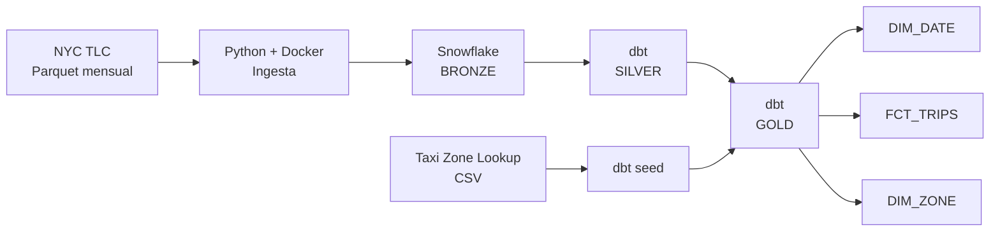

# Laboratorio Integrador I — NYC Yellow Taxi ELT Pipeline

Pipeline ELT reproducible para ingerir, almacenar, transformar y modelar datos de **NYC Yellow Taxi** utilizando **Python, Docker, Snowflake y dbt**.

El proyecto implementa una arquitectura **Bronze → Silver → Gold** y un esquema estrella orientado al análisis de viajes.

## 1. Arquitectura



Diagramas detallados:
- `docs/architecture.md`
- `docs/star_schema.md`

## 2. Estructura

```text
semana-07/
├── .env.example
├── .gitignore
├── README.md
├── data/
├── dbt/
│   ├── dbt_project.yml
│   ├── profiles.yml
│   ├── macros/generate_schema_name.sql
│   ├── models/
│   │   ├── bronze/sources.yml
│   │   ├── silver/
│   │   │   ├── stg_yellow_taxi.sql
│   │   │   └── stg_yellow_taxi.yml
│   │   └── gold/
│   │       ├── dim_date.sql
│   │       ├── dim_zone.sql
│   │       ├── fct_trips.sql
│   │       └── gold.yml
│   └── seeds/taxi_zone_lookup.csv
├── docs/
│   ├── architecture.md
│   └── star_schema.md
├── infraestructura/setup_snowflake.sql
├── ingesta/
│   ├── Dockerfile
│   ├── ingest.py
│   └── requirements.txt
└── orquestacion/run_pipeline.ps1
```

## 3. Datos

El pipeline está diseñado para procesar enero–diciembre de 2025 y enero–agosto de 2026. Los archivos mensuales siguen el formato `yellow_tripdata_YYYY-MM.parquet`.

Durante la ejecución del laboratorio estaban disponibles los 12 meses de 2025 y enero–julio de 2026. El archivo de agosto de 2026 no se encontraba disponible en la fuente consultada, por lo que la ejecución documentada contiene **19 archivos mensuales**. El pipeline conserva agosto dentro del rango esperado y vuelve a comprobar su disponibilidad en futuras ejecuciones.

## 4. Bronze

Tabla: `NYC_TAXI.BRONZE.YELLOW_TAXI_TRIPS_RAW`.

Bronze conserva el registro original como `RAW_RECORD VARIANT` y agrega `SOURCE_FILE`, `SOURCE_YEAR`, `SOURCE_MONTH` e `INGESTED_AT`.

La ingesta comprueba `SOURCE_FILE` antes de cargar cada archivo, evitando cargar nuevamente meses ya procesados.

**Filas observadas: 75,089,241.**

## 5. Silver

Modelo: `NYC_TAXI.SILVER.STG_YELLOW_TAXI`.

Silver realiza tipado y estandarización, conversión de timestamps, cálculo de duración, generación de un hash determinístico, deduplicación e indicadores explícitos de calidad.

Los flags identifican, entre otros, passenger count o rate code faltantes, distancia cero, importes negativos, cero pasajeros, passenger counts sospechosos, duración inválida y timestamps fuera del mes indicado por el archivo.

Los valores atípicos no se eliminan indiscriminadamente: pueden representar ajustes, viajes que cruzan límites mensuales u observaciones con información parcial. Se conservan y se marcan mediante flags. Solo los duplicados exactos detectados mediante el hash son eliminados.

Se encontraron **2 registros redundantes**:

```text
Bronze: 75,089,241
Silver: 75,089,239
```

## 6. Gold

Gold implementa un esquema estrella.

**Grano de `FCT_TRIPS`: una fila por registro de viaje Yellow Taxi deduplicado.**

`trip_id` es un identificador técnico determinístico y no un identificador oficial de NYC TLC.

Relaciones principales:

```text
pickup_date_key       → DIM_DATE.date_key
dropoff_date_key      → DIM_DATE.date_key
pickup_location_id    → DIM_ZONE.location_id
dropoff_location_id   → DIM_ZONE.location_id
```

Conteos observados:

| Modelo | Filas |
|---|---:|
| `FCT_TRIPS` | 75,089,239 |
| `DIM_DATE` | 588 |
| `DIM_ZONE` | 265 |

`DIM_DATE` y `DIM_ZONE` funcionan como dimensiones de rol para pickup y dropoff.

## 7. Validación

El proyecto implementa tests dbt `not_null`, `unique` y `relationships`.

Los tests Gold validaron las claves de las dimensiones, `trip_id` y las cuatro relaciones entre la tabla de hechos y las dimensiones.

Resultado final Gold:

```text
PASS=18
WARN=0
ERROR=0
SKIP=0
TOTAL=18
```

Conteos finales:

| Capa / modelo | Filas |
|---|---:|
| Bronze | 75,089,241 |
| Silver | 75,089,239 |
| Gold — FCT_TRIPS | 75,089,239 |
| Gold — DIM_DATE | 588 |
| Gold — DIM_ZONE | 265 |

La igualdad entre Silver y `FCT_TRIPS` confirma que Gold conserva el grano de un viaje deduplicado por fila.

## 8. Requisitos

- Docker Desktop
- Acceso a Snowflake
- Autenticación Snowflake mediante key pair
- PowerShell

No es necesario instalar dbt localmente; se utiliza la imagen Docker de `dbt-snowflake`.

## 9. Infraestructura Snowflake

El archivo `infraestructura/setup_snowflake.sql` crea el warehouse, database, schemas Bronze/Silver/Gold, role del pipeline, file format Parquet, stage interno, tabla raw y permisos necesarios.

Debe ejecutarse inicialmente con un rol con privilegios suficientes, por ejemplo `ACCOUNTADMIN`.

Después debe asignarse el role al usuario correspondiente:

```sql
GRANT ROLE NYC_TAXI_ROLE TO USER <YOUR_SNOWFLAKE_USER>;
```

## 10. Variables de entorno

Crear `.env` a partir de `.env.example` y completar la configuración de Snowflake.

`.env` y la clave privada contienen información sensible y **no deben subirse a Git**. La clave privada permanece fuera del repositorio, en el directorio local `~/.snowflake/`, que se monta como volumen de solo lectura.

## 11. Ejecución completa

Desde la raíz del repositorio:

```powershell
& ".\laboratorios\semana-07\orquestacion\run_pipeline.ps1"
```

El script:

```text
1. Valida la configuración local
2. Construye la imagen Docker de ingesta
3. Ejecuta la ingesta hacia Bronze
4. Ejecuta dbt seed
5. Ejecuta dbt run
6. Ejecuta dbt test
```

Al finalizar correctamente:

```text
PIPELINE COMPLETED SUCCESSFULLY
Bronze -> Silver -> Gold
```

## 12. Reejecución e idempotencia

La ingesta comprueba si cada `SOURCE_FILE` ya existe en Bronze antes de cargarlo. Por ello, reejecutar el pipeline no vuelve a insertar archivos mensuales ya procesados.

dbt reconstruye Silver y Gold a partir de los datos disponibles. La prueba de reejecución del pipeline terminó correctamente sin duplicar los archivos ya cargados.

## 13. Tecnologías

- Python
- Docker
- Snowflake
- dbt
- PowerShell
- Mermaid
- Git / GitHub

## 14. Resultado

```text
NYC TLC
   ↓
Python ingestion
   ↓
Snowflake Bronze
   ↓
dbt Silver
   ↓
dbt Gold
   ↓
Star schema
   ↓
dbt tests
```

La solución conserva los datos raw y su metadata en Bronze, aplica reglas explícitas y auditables de calidad en Silver y ofrece en Gold un modelo dimensional orientado al análisis de viajes.
