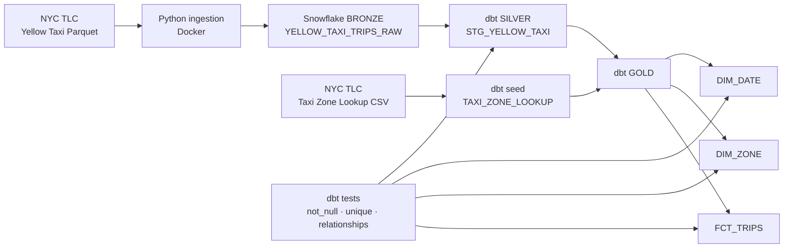

# Diagrama de arquitectura — NYC Yellow Taxi ELT

## Flujo

1. Los archivos mensuales de NYC Yellow Taxi se descargan automáticamente desde la fuente pública de NYC TLC.
2. La ingesta se ejecuta dentro de Docker y carga los registros originales en Snowflake Bronze.
3. Bronze conserva el registro fuente en `VARIANT` y agrega metadata de archivo, año, mes y fecha de ingesta.
4. dbt transforma Bronze en Silver, donde se tipan los campos, se generan indicadores de calidad y se eliminan duplicados exactos identificados mediante un hash determinístico.
5. El Taxi Zone Lookup se carga como un seed de dbt.
6. dbt construye el esquema estrella Gold con `FCT_TRIPS`, `DIM_DATE` y `DIM_ZONE`.
7. Los tests de dbt validan nulabilidad, unicidad e integridad referencial.
