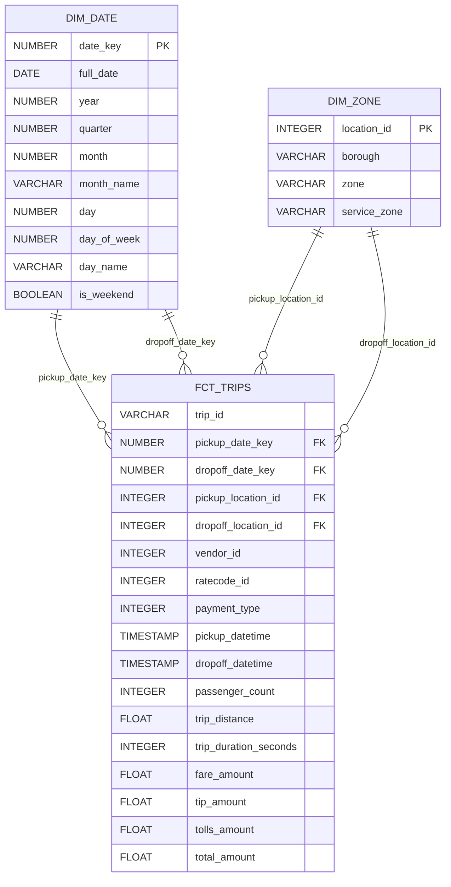

# Diagrama de esquema estrella — Gold

**Grano de `FCT_TRIPS`:** una fila por registro de viaje Yellow Taxi deduplicado.

`DIM_DATE` funciona como dimensión de rol para pickup y dropoff. `DIM_ZONE` se reutiliza de la misma forma para las zonas de origen y destino.

Las claves foráneas fueron validadas mediante tests `relationships` de dbt. Las claves de las dimensiones fueron validadas con `not_null` y `unique`.

`trip_id` es un identificador técnico determinístico; no corresponde a un identificador oficial proporcionado por NYC TLC.
